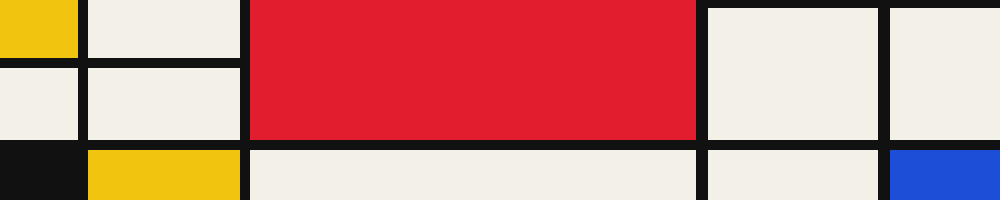

  

### hey! i'm flora :)
here's a little about me, i'm: \
🌺 an undergrad studying computer science at uw seattle \
🧠 computational research assistant @ [anna gillespie lab](https://www.gillespie-lab.com/) \
👾 currently: swe intern for [visa](https://www.visaacceptance.com/en-us.html) acceptance solutions (analytics team!)

<!--
**florayasmin/florayasmin** is a ✨ _special_ ✨ repository because its `README.md` (this file) appears on your GitHub profile.
সালাম • hello • السلام علیکم • hola • नमस्ते
Here are some ideas to get you started:

- 🔭 I’m currently working on ...
- 🌱 I’m currently learning ...
- 👯 I’m looking to collaborate on ...
- 🤔 I’m looking for help with ...
- 💬 Ask me about ...
- 📫 How to reach me: ...
- 😄 Pronouns: ...
- ⚡ Fun fact: ...
-->
